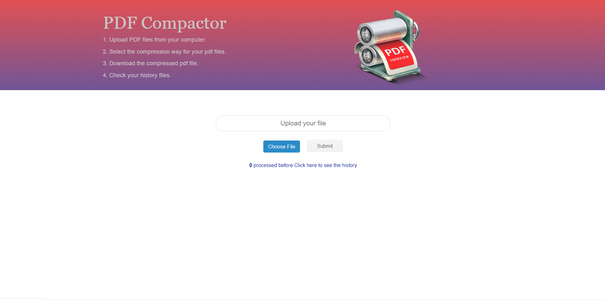

# PDF Compactor Project
a web application that allows users to upload a pdf file and return a compacted version of the file based on the user’s specified DPI. 

# Process Of the whole full_stack


# Tools
## Frontend
 Bootstrap + HTML + JQuery + CSS
## Backend  
 Node.js + express + multer + Ghostscript
## The pdf compression rools URL
https://github.com/ourarash/shrinkpdf

# Start The Project
Firstly, install NodeJs (https://nodejs.org/en/download/) and Ghostscript (check this link carefully https://github.com/ourarash/shrinkpdf). 
```bash
git clone https://github.com/guiquansun/PDF-Compactor.git
cd PDF-Compactor
npm install
```

Running:
```bash
node app.js
```
Now open your browser to http://localhost:3000

Upload a pdf file and the page is switched.

CLick Process button to do the compression

See your history files


# Group members
Linxin Mai linxinma@usc.edu
Guiquan Sun  gsun@usc.edu
